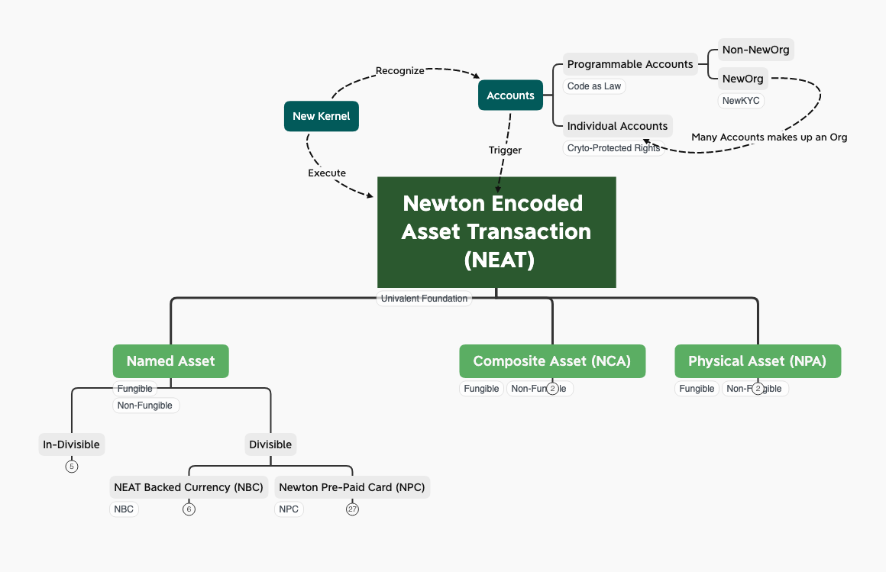
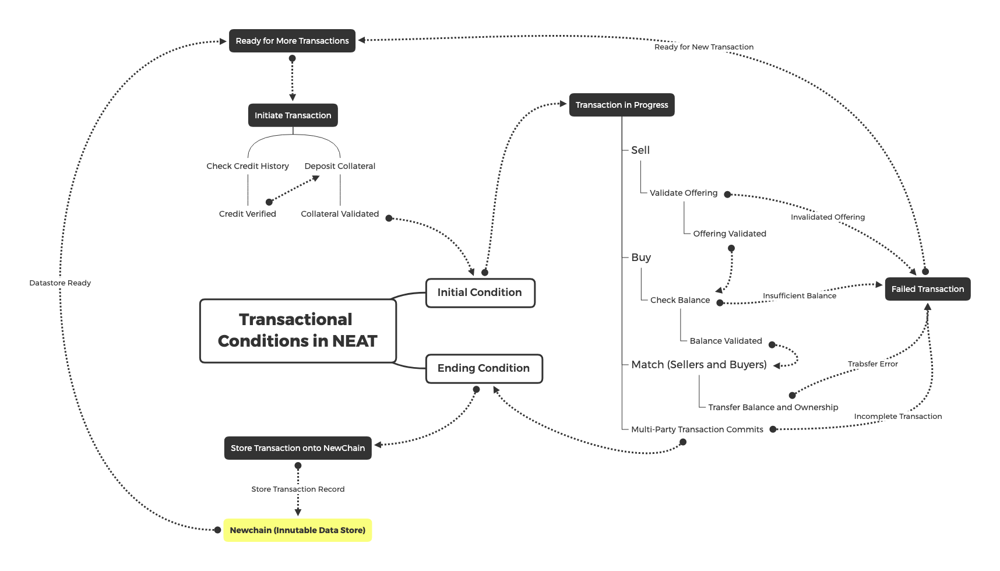
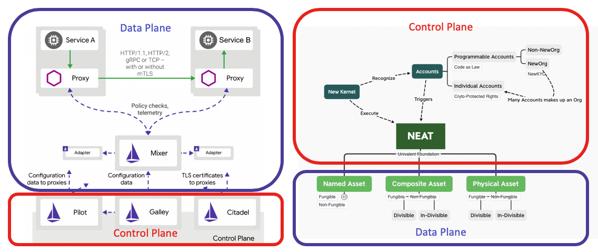

# NEP 20: Newton Encoded Asset Transaction (NEAT)

| Item | Description |
|:-|:-|
| NEP | 20 |
| Title | Newton Encoded Asset Transaction|
| Authors | [Ben Koo](mailto:koo0905@gmail.com), [Evan Liu](https://github.com/evanliuchina), [Xia Wu](https://github.com/xiawu), [Jiang Tao](https://github.com/jiangtao-tang) |
| Discussions to | https://github.com/newtonproject/NEPs/pull/20 |
| Status | Draft |
| Type | Standard |
| Category | Technical |
| Created | 2020-04-24 |
| Updated |  |

## Simple Summary

Newton Encoded Asset Transaction(NEAT) defines the root data type for all asset exchanges. Once a new record of NEAT is registered into Newchain, it represents a form of irrefutable accountability based on the immutable features of Newchain. To help transaction assess the worthiness of transactions before their commitment, all transactions have a common field, called: Bounded Accountability, which defines all known exit conditions when a transactional process is breached. From an economic viewpoint, the security of every transaction must be insured by worthwhile collateral assets, which include the reputation history of the exchange participants. To make transactions trust-worthy, all transactions must be encoded as an executable algorithm, and all human initiated asset exchange execution are authorized by cryptographically ensured procedures. NEAT delivers Bounded Accountability of transactions by representing transactions based on

 1. trust-worthy timestamps,
 2. irrefutable asset identities,
 3. non-repudiable agreement actions,
 4. deposited collaterals.

 NEAT can be seen as a Domain Specific Language (DSL) that is dedicated to represent transactional accountability. The domain represented by DSL is the domain of transactions, since all subsequent transactions are reprented by the root data class, NEAT. More importantly, only NEAT and its subclasses will be recorded on Newchain, which will become durable and accountable in the history of NEAT execution. As a DSL, NEAT provides a small, yet expressive vocabulary of asset types, so that practical business transactions can be composed of NEAT to represent a broad range of economic activities with computable risk profiles with a common field: Bounded Acountability. NEAT presents a small set of asset types as its linguistic primitives. For instance,  NewID/NewKYC accounts, [NEP-21: Newton Physical Asset](nep-21.md), [NEP-22: Newton Composite Asset](nep-22.md). It is based on these primitives, applications such as [NEP-23: NEAT-backed Currency](nep-23.md), [NEP-24: Newton Prepaid-Card](nep-24.md) can be defined for practical use. The notion of Buy, Sell, Borrow, and Bid, are the actions or verb primitives of NEAT. The runtime execution of NEAT is carried out by NewKernel, and all transactional records will be immutably stored on Newchain. The following diagram outlines the architecture of the NEAT execution environment.




## Abstract

Newton Encoded Asset Transaction (NEAT) is a Domain Specific Language (DSL) that represents asset transactions with computable Bounded Accoutability. The goal of NEAT is to provide a rigorous language to construct asset  portfoilios on an exchange platform to facilitate asset-sharing practice. NEAT facilitates sharing by always make both providers and receivers of the asset accountable of their actions in terms of bounded collaterals. Every NEAT-based transaction must have computable and verifiable data items that represent the accountability of the transaction participants. In other words, all participants must earn their reputation over time, or they must deposit a reasonable amount of asset to insure their own transactional actions. With Newton's immutable ledger and accounts represented by NewID, accounts with good credit history will be able to carry more trust-worthiness and will be given more freedom in practicing wider ranges of commercial activities. To instill accountability to every NEAT-based transactions, every transaction is associated with the following security features:
* every transaction should be guaranteed by a set of collateral asset, deposited by participants of the transactions or the transaction platform.
* all transactions must be tagged with secure timestamping services,
* public keys for participating accounts (NewID and NewID-based NewKYC),
* globally defined asset identities (IPv6, MAC Address, and other IoT and asset-specific tags)
* composable semantics of delivery/reception mechanisms based on pi-calculus.
* Univalence: All NEAT utilizes a unifying security model, the degree of security should be measured by equivalent units, measured in Newton. Newton as a currency is bound to physical time.

## NEAT as a DSL for Transactional Operations

From the highest abstraction level, all transactions are composed of three main types of operations, Selling, Buying and Matching of Buyer/Sellers. These three operations are to be recorded into an immutable transactional datastore, as shown in the following diagram:



The most common states are listed in the following table:

| Function | Description | Permission |
|:-|:-|:-|
| Ready for More Transactions | Allow additional transactions to be processed on NEAT. | System Level |
| Initiate Transaction | Allow NewID accounts to intiate new Transactions | NewID Accounts |
| Seller Ops | Create a new offerings to be bought, including credit and offering validations | NewID Accounts |
| Buyer Ops | Create a new bid to obtain products or services | NewID Accounts |
| Matching Ops | Match Buyer(s) and Seller(s) based on NEAT Contract |  System Level |
| Transaction Completion | After all commitments are checked, automatically store transaction records on Newchain |  System Level |
| Failed Transaction Conditions| Terminate Transaction based on contractual conditions.| System Level |
| Bounded Accountability | Every NEAT and its subclasses will be associated with one entry of Bounded Accountability | System Level (Editable Once by the NewID account of Initiate Transaction) |


Technically speaking, NEAT is a domain-specific language with a immutable transaction ledger and a unifying real-world clock. It can be expanded to encode other types of transactions that follows this generic pattern. The main objectives of creating NEAT is about creating a unifying namespace to , so that knowledge derived from operating this transactional ledger can be uniformly shared to improve the soundness and precision of transaction accountability. NEAT as an abstract specification of a DSL in the Domain of Bounded Accountability is not limited to a specific stack of software/hardware technologies. However, NEAT's initial reference implementation will be bound to the archietctual patterns of Serverless Applications, Function as a Service (FaaS), Event Sourcing, Command Query Resposibility Segregation (CQRS), and the process patterns, DevOps, GitOps, and MLOps. These architectural guidelines will limit the technical discussion, and engineering implementation to a specific level of data abstraction, particularly bounded to time-oriented namespace management. This temporally-oriented design principle will permeate the overall engineering efforts, including the design and implementation of human-data interaction interfaces.

## Motivation

NEAT is about providing a unifying, and formally verifiable data type that represents asset transaction activities on Newchain. The motivation to unify transactional data on one formally verifiable data type is to avoid human intervention without valuable collaterals and maximize knowledge reuse with respect to transaction processing. This data type would allow anyone with a Newchain account to participate in a transparent and unbiased asset transaction service, purely defined by executable logical contracts. The accountability of transactional activities is grounded in Newchain, whose infrastructure provides trust-worthy facts through irrefutable account-based actions and immutable event occurrence sequence. To maximize knowledg reuse, NEAT is defined as the root class for all other types of transaction. Having one unifying base class, provides a discipline to organize and compare the differences between all transaction processing strategies. This unity will significantly reduce the complexity of system development and maintenance, therefore minimize the transaction processing cost (cost of middleman).   

### Time-bound ACID Transactions

A key feature of NEAT is the notion of Bounded Accountability. The security of accountability is to ensure by data security, often prescribed as the [ACID](https://en.wikipedia.org/wiki/ACID) properties of transaction, Atomicity, Consistency, Isolation, and Durability. The "economic value" or transactional accountability is bounded by the "correctness" of contract execution during runtime. Therefore the correctness is also bounded by a time window, from the time point of contract initiation, up to the point of contract fulfillment or failure acknowledgement. Knowing that Newchain is an non-stoppable real-time immutable data store infrastructure, participants of NEAT-based transactions can judge the boundaries of accountability based on the physically meaningful timestamps, and ACID properties associated with data transactions. All claims of accountability must be follow the consistency in timestamped records to infer their respective judgemental outcomes. Combining this timestamped data with formal data analysis tools, such as the System Specificatin language: TLA+<sup>[9](#ref-9)</sup>. An abstract specification language such as TLA+, can be used to define the possibility space of accountability in temporal dimensions, and allow the possibility state space to be symbolically enumerated and examined by participants prior to commiting to certain transaction. Therefore, either transaction participants conduct extensive verification processes using formally defined logic, or they simply declare the admission of bounded risks, and therefore agree to the said Bounded Accoutability. By explicitly denoting transactions with a computable field: "Bounded Accountability", such data field provides a formal structure to express risk profiles of all transactional activities uniformally. All risks that participants are willing to take can be expressed in a set of objectively defined risk assessment statement executable by temporal logic.

#### Temporal Logic Reasoning Engine: Behavioral Equivalence

To make NEAT pratical, yet pertains sufficient robustness from error, the vocabulary of NEAT, will need to be incrementally refined to fit the changing application contexts. The refinement process will be supported by formal method tools, such as TLA+. Tools such as TLA+ will first denote distinguishable transactional states of transaction activities, and then, use these time-based state notation to classify different kinds of asset transaction activities. This is also where the overall system establish [*equivalence*](https://youtu.be/slVcTtwX_Sk?t=191) between transactional processes with different names. Then, these classified transactional activities can be assigned context-dependent terms, and these terms will be managed in a globally managed NEAT reserve word dictionary. This global dictionary of NEAT defines equivalent classes of transactional behavior, so that all transactional behavior will be grounded in the namespace of formal analysis, not in the context-dependent namespace. Grounding all transaction models with a formal behavioral representation allows the NEAT system to evolve around abstract specifications. Concrete implementation and operational data will also be referenced in the overall knowledge base, but they will only serve in a supportive role for evolving the NEAT language.

#### Vocabulary Management in Wiki

As NEAT gets applied in operational contexts, natural language synonyms of these formally defined vocabulary will be slowly admitted to the dictionary of alias, published in a distributed wiki database. This wiki database provides a common repository for participants to publish and read the definition of different types of transactional activities. The natural language oriented content of Wiki, allows many kinds of people ,allowing non-technical people to better engage with NEAT. The design and evolution of NEAT, will follow the methodology of [Domain Deriven Design(DDD)](https://en.wikipedia.org/wiki/Domain-driven_design), where the domain is grounded in temporal logic. Knowing that time arrow will always increase entropy, the namespace of NEAT will simply be version controlled using uniquely defined time-stamps on Newchain. In other words, the version control mechanism of NEAT's dictionary is grounded in Newchain's timestamp sequence. This grounding uniquely combines namespace management with the trust-worthy time-stamping service provided by Newchain, an entropy-based namespace management strategy can naturally classify increasingly complex transaction types, and therefore define all the namespace of known transaction types under one unified dictionary. Intentially maintain logical consistency through the use of one trust-worthy timestamp service, the namespace evolution governed by the second law of thermodynamics will provide the cornerstone to unify the developmental approaches to transaction processes. This time-bound namespace management strategy will support an future-proof transactional processing infrastructure that maximally avoid redundancy in the development and maintenance of transaction processing services.

### User Experience Design surrounds Time, Immutability and Irrefutability

NEAT is designed to support transactional activities between humans. Therfore, the irrefutability of NEAT can be accepted when human participants can consciously agree with transactional actions and records. Participant awareness is built-in a common user experience design framework by following three key human interaction components:
* Actions defined by a time-bound namespace: Users need to know that all transactional actions are distinguished by a unifying timestamp system. The uniqueness of their actions are guaranteed by an irreversible sequence.
* Record Immutability: Once finished, all transactional records goes into an "immutable" state, meaning that NEAT records will never be changed after it is committed.
* Irrefutable accountability: Once participant agrees to do something at certain time point, the irreversibiliy and immutability of this transaction system make the decision maker accountable for their earlier decision. All decision are final at the time points of transaction execution.

In other words, since all other transactions are defined under the umbrella of NEAT, by designing a set of User Interfaces guidelines to ensure human participants are aware of time, immutability, and irrefutability, the transactional system can be accountably deployed to the public.


## Specification

Technically, NEAT is designed as a base transactional language with time-bound trust-worthiness. It defines a set of foundational syntax and vocabulary in a structured namespace, specifically organized in Newton Asset Namespace (NAM). NAM provides a unifying framework to named implementations of encryption algorithms, secure timestamp mechanisms, and account security based on Newchain. By using a formalized namespace to manage the identities of the assets being exchanged, and the secured mechanisms of how this asset is being delivered, NEAT provides a unifying exchange protocol for all asset exchange bookkeeping between its community members. NEAT being the root class of asset transaction records, allows other types of assets to be encoded following or extending the possible definitions of asset transaction activities. This data structure is independent of the particular kind of assets that it is being exchanged.

### NEAT Syntax

NEAT is a base class that can be extened to make up Newton Composite Asset (NCA), that are composed of multiple instances of NEATs. The syntax for defining composed NEAT and its composed structure, NCA, is based on pi-Calculus. pi-Calculus is the formalism of encoding processes and their interactions as a [rewrite system](https://en.wikipedia.org/wiki/Abstract_rewriting_system). Every NEAT is defined as follows:

```
NCA, NEAT :=   
                Receive and Send asset a from Transaction Channel C,  run NEAT or NCA;  
                Concurrently Execute NEAT and NCA;
                Create a new Transaction Channle X, run NCA;    
                Repeat multiple instances of NCA;
                Terminate all NCA transactions;
```

More detail of NEAT syntax will be explained in [NEP-22: Newton Composite Asset](nep-22.md), because data asset is compositional in nature, and the data content of a NEAT is almost always composed of other data types.


### NEAT Semantics

The uniqueness of NEAT is defined by a combination of transactional channel C, asset *a*, time *t*, and a hashcode of Executing Condition h(E). In practice, all NEAT must have access to collaboral asset CA, and a set of reimbusement rule RR given different conditions during breach of contract.
The meaning of the variable names mentioned above are defined here:

| Variable Name | Annotation | Explaination |
|:-|:-|:-|
| NEAT | NEAT_p, NEAT_q represents distinct instance of NEAT | named transactions based on the unique combination of C(x,y), a, t (Time), and a Hashcode of Executing Conditions |
| C(x,y) | Account names: (Issuing Account)+ ":" (Receiving Accounts)+ |The direction of asset transfer: x Issuing Accounts -> y Receiver Accounts|
| *a* | Asset IDs : (Asset ID)*  ":" (Asset ID)* |  a represents the set of (Asset ID)* to be transferred to from x to y |
| *t* | Time: (Newchain timestamp)+ | A sequence of timepoints of actual transactional events marked by (Newchain timestamp)+ |
| E | Executing Conditions: (Deliver Condition)+ ':' (Reception Condition)+ | (Deliver Condition)+ ':' (Reception Condition)+ are two set of rules that defines the delivery and reception conditions of asset right transfer. Maybe associated with timestamp information shown in (3).|
| CF | Comment Field: (Natural Language content that describes the contract) | A field dedicate for human understanding, like the Ricardian Contract. The comments of NEAT can be written in a formatted template, the format could follow Logic Model.|
| CA | Collateral Asset: (Asset ID)+ Collateral asset as a guarantee for participants of this transaction. This is usually defined by the insurance policy for the amount of resources to be issued to participants when transactions failed. | (Asset ID)+ should be a set of transferrable assets that will be ditributed in case the transaction fails. Initially, this can be certain amount of Newtons made available to insure the risk coverage of possible transaction failure modes. |
| RR | Reimbursement Rules: (Rule for Reimbursement)+  A contract explicitly defines how to reimburse the participants when the transaction failed to work. The allocation of funds should be independent of the creator of this NEAT type. | (Rule for Reimbursement)+: An automated executable contract, written in scripts that would allocate the available cryptographically ensured funds to participants according to various deliver/reception status. The creator of the executable contract should demonstrate that they are NOT in positions of conflict of interest. |

### Human Interface Design

Since all subsequent information are subclasses of NEAT data and its organized by a unifying logical clock. It would be necessary to present a unifying user interface to present these temporal data at different scales. The design method can consider the formalism presented by Chris Stolte et al, in their Multiscale Data Cubes approach<sup>[8](#ref-8)</sup>(http://graphics.stanford.edu/papers/pan_zoom/paper.pdf).

### Explicit Guarantees

The value guaranteed by NEAT can be supported by the following explicit guarantees:
* Collateral Assets: all NEAT should have assets dedicated to guarantee the integrity of the transaction.
* Prior Transaction Records: the historical records of how the identical or similar NEAT was executed with immutable historical data.
* Mechanized Proofs: The "Executing Conditions" is the explicit contract that spells out the boundary conditions of how transactions are fulfilled. It should be accompanied by a set of testable conditions, that has an accompanying mechanized proof program to statically check the logical integrity of "Executing Conditions". Overtime, the "Executing Conditions" can be enriched based on operational data to avoid any conflict of interests.
* Strength of Cryptographic Protection: The system assumes that account actions are initiated by agents who didn't lose their passwords or their cryptographic system are asserted to be in tact. For low risk and low value transactions, cryptographic systems with lower degree of security can be guaranteed by having some form of collabteral assets.

By allowing these three types of explicit guarantees, the value of each NEAT is protected and transaction data recorded on the chain. This also helps to isolate the dependencies between different NEAT, in case some transactions or businesses caused any suspectable results, their problems can be totally independent from other NEAT. The overarching idea is to accommodate all levels of security and asset guarantees based on a lattice-based security classification system. In other words, the levels of guarantee are given a consistent lattice-based namespace to make the risk exposure to be explicit.


## Rationale of Bounded Accountability

The acountability of NEAT transactions are insured by a set of complementary mechanisms, such as security levels characterized in cryptographics, the amount of deposited collaterals, and the algorithmic properties of mechanized proofs. All transactions are assume to only carry risk levels up to the parameterized boundary, therefore, having a set of certified human-machine interfaces, and the relevant computable implementations of Bounded Accountability are essential features of NEAT. When assets are considered to be more valuable than the representable insurance policy, these mechanisms, including human-machine interfaces should prevent assets to be engaged in a NEAT transaction. This protective mechanism works both for the human participants, as well as the NEAT operating infrastructure. On the side of human participants, NEAT exchange should only be initiated after certain security deposit or prior reputation can cover the allowed Bounded Accountability. On the operational side, by parameterizing risk profiles in terms of computable/decidable terms, it becomes possible to automatically assess a large number of transactions in a wide range of application contexts. In other word, the notion of Boundary is determined by the computability of risk parameters. Without presenting risk profiles in terms of computationally representable and effectively computable expressions, it would be impossible to ochestrate the astronomical volume and types of transactional activities that can be automatically conducted using currently existing Internet of Things infrastructure.


### Balancing Security Protection Pragmatically

The above mentioned guarantee mechanisms together form a mutually dependent protection ecology. A NEAT without the protection of sound cryptographic security system, or it doesn't have an automatically verifiable proof, the participants should not put down too much Collateral Assets to guarantee the specific NEAT transaction. On the other hand, when the maturity of NEAT "executable conditions" are throughly tested both operationally with historical records, and mechanical proof results, then, it would be much likely that such NEAT is going to deserve larger amount of collateral assets. The key idea is that NEAT is a platform to allow participants to dynamically construct a bounded security using existing infrastructure, without waiting for all four conditions to reach perfection.

### Freedom in Constructing Transactional Contracts

The transactions of digitally representable assets can be best illustrated by the four fundamental rights as explained by Richard Stallman's "Free Software, Free Society"[[available here](https://www.gnu.org/philosophy/fsfs/rms-essays.pdf)].
| Free Software | pi-Calculus Concept |
|:-|:-|
| The right to use Software |The choice to engage certain interactive process (Human choose to use certain piece of software)|
|The right to understand the working mechanisms of Software | Parallel execution of the software, including mirror the understanding of the working principles|
|The right to modify the software for other Uses | Change the software in ways that covers the way it didn't work before (Prohibit or enable certain new functions)|
|The right to re-distribute the modified Software | Replicate the software/data asset in alternative distribution channels (Re-distribution for profit)|

Leveraging the fundamental rights to the four composable rules, one can define a way to cover a wide range of data asset transaction scenarios that have been investigated for decades by prior luminaries, such as Richard Stallman,  Robin Milner, and Leslie Lamport.

## Implementation

## High Level Architecture Design Principles

NEAT as a generic format of transaction, is the data structure that controls the states for all asset transfer. It is also an extensible programming language with a particular application domain. Its syntax, semantics and pragmatics can be defined using formal language modeling tools, such as the [K Framework](http://www.kframework.org/index.php/Main_Page). Overtime, the system does NOT need be bound to specific tools or speicific implementations. For example, NEAT can be implemented using hand coded C, or automatically generated code modeled on K Framework. NEAT's underlying time-oriented data store, do not necessarily need to be bound to blockchain-based transaction model. Any transaction model that fulfills the notion time-based Bounded Accountability, as specified by the abstract specification will be admitted. This document is intended to be written as an implementation neutral specification, that can be examined in terms of abstract logical arguments, not in terms of the run time performance of engineering artifacts. Therefore, this document is intentionally written as an abstract specification of NEAT, and its implementation should be separated from this specification. At the same time, NEAT is also an operational platform, it needs to leverage existing engineering wisdom and tools that has already demonstrated scalability and technical sophistication. So that the following section will present the guidance in implementing a scalable NEAT infrastructure.

### Event Sourcing, CQRS, and DDD

Since NEAT is highly depedent on time, the software implmentation strategy should be aligned with known architectural patterns that provides time-sensitive data structures. For example, to implment concurrent systems, adopting event sourcing<sup>[10](#ref-10)</sup> patterns such as CQRS<sup>[10](#ref-10)</sup> (Command Query Resposibility Segregation), and define transactions in terms of their business domains using [DDD](https://en.wikipedia.org/wiki/Domain-driven_design) (Domain-driven Design), are high level architectural designs that do not directly involve coding. By separating design from implementation has many long term advantages, and allow implementation decisions to be based on architectural arguments, not based on implementation details.

The focus of NEAT is all about secure real-time transactions, that means performance is of utmost critical concern. Using design patterns such as Event Sourcing, it is possible to better investigate broadly applicable design solutions without involving source code level experiments. More importantly, it allows implementers to systematically search for industrial strength solutions that are designed to solve these fundamental, system-level issues, such as security, high performance, irrefutable transaction processing. Even if these technical solutions are solved by our own implementation, it should be organized as a generic tool that can be reused in other projects.

To manage data at scale, NEAT will follow an architectural guideline that separates the overall system into two planes, namelythe Control Plane and Data Plane. The purpose of separating data from the controlling mechanism is to embrace the convention in the Cloud Native movement. Separating systems into composable modules made of meshed services. The origin of this idea of Control Plane vs. Data Plane was popularized by Istio's Service Mesh architecture. However, this high level division of responsibilities is a useful guideline. The matching classification to NEAT and Newton's namespace is shown as below.



### Continuous Workflow in evolving NEAT

Implementing a programming language is about testing hypothesis of adopting various vocabulary in the expanding application contexts. Therefore it is a continuous learning process, and requires certain guidance in keeping pace of such wide open context of learning. A model to keep workflow in check is the well known Khun Cycle, similar to most Continuous Integration and Continuous Delivery/Deployment (CICD/CD) workflow. The term CI/CD is also very much tied to the notion of [DevOps](https://resources.collab.net/devops-101/what-is-devops), as "Development" of new code base must be tightly integrated with the way data services are being "Operated". The bluring of boundaries between model development and model operation is an inevitable trend as the cycle time of source code evolution is turing at a speed that can only be captured by having the entire development and deployment process run on a fully automated workflow. This fast-evolving idea of code evolution is compatible with the notion of Kuhn Cycle. The key concern in [Kuhn Cycle](https://www.thwink.org/sustain/glossary/KuhnCycle.htm) is the idea of acquiring new vocabulary when the system reaches or identifies "immcommensurability" in its operating experience (problems detected through Data Plane). By applying CICD and being mindful of Kuhn's vocabulary detecting/collecting Cycles, NEAT will become a living engine that is capable of learning and implementing new ideas. In other words, NEAT is designed as a community-based programming language, its own evolutionary cycles should follow a governance model that is similar to the experience of develping new versions of the NEAT language. In other words, NEAT aims to openly invite anyone to participate in the definition of a transaction processing language that is version controlled by a distributed timestamp system. Vocabulary has value, publically accepted vocabulary has measurable value. Ideally, the new NEAT types are new "models" learned from operational data, sometimes automatically learned through formal method tools or machine learning workflows. In the case of Newchain, since operational data are immutable data, capturing data content with "real" timestamps. These immutable and publicly revealed data can be the ideal grounding data for [MLOps](https://wiki2.org/en/MLOps), as the Machine Learning enabled version of DevOps.


#### Control Plane (Dev)

Newton Community's Infrastructure will carry the responsibility of offering the controlling mechanisms of non-repudiability and irrefutability trace. Newton Community demonstrate its service security through the liveness and safety of its "service mesh", or the "Controlling Mechanism" of the operational data. Using this framework, a significant amount of existing code base can be leveraged for use immediately. In the Istio Architecture, the controlling mechanism for security is often called: "Citadel" component. Using existing code base that already has been tested by industrial strength solutions will drive the total amount of data to be processed through Newton Infrastructure.

#### Data Plane (Ops)

The role of NEAT data type is to provide a typing classification scheme for ongoing implementation of specific asset types. Therefore, the focus of NEAT is to become a template, the unifying implementation to ensure the subsequent classes of application specific asset type could enjoy the same level of data security. From an practioner's viewpoint, overtime, NEAT should have a significant number of application specific subtypes, such as the initally planned [NEP-23: NEAT-Backed Currency](nep-23.md) and [NEP-24: Newton Pre-paid Card](nep-24.md) . As the specific sub-types grow in number, more specific applications will have their own tailor-made data types. However, as the sub-type grow in number, the possible errors and potential redundancy will naturally dissipate attention and therefore increase the cost of source code quality maintenance. Therefore, the idea here is to design NEAT as the unifying data type for a programming language. A language specific dedicated to distributed transaction processing engine. Then, the vocabular adopted overtime, could be reused throughout the community, and even over the entire Internet. This way, we can encourage reuse of the high-level architecture. In other words, the Data Plane of NEAT is a dictionary for other implementation. We will design NEAT as a Domain Specific Language that can be customized and extended to other application specific languages. Then, the likelihood of having patterns in NEAT, such as NEAT-backed Currency (NBC) and NPC to be reused could be hidden in the implementation, so that the technical properties can be preserved. It is expected that implementers will add features within their own applications, and by managing the vocabulary as the Data Plane for a service system, we can alleviate some risks in being drawn to serve many design goals. Thereshould be only one unifying set of design goals in NEAT, that is to ensure system correctness, via safety and liveness concerns. Data security represent safety, and Performance features enables liveness possibilities.


###  Namespace Management with Formal Methods and Industry Practices

NEAT as a transaction protocol should define its namespace using Formal Methods and tools. For example, the critical terms, such as Transaction Initial Condition and Ending Conditiion, should be listed as reserved words using tools such as TLA+ to examine their tempoal logic possibilities. The namespace practice should not be only dependent on committee-based voting procedure, but it must include the analysis model of temporal dynamics, and then, use the analysis model as a collateral to support the decision for expanding or reducing the namespace of NEAT.
NEAT should adapt open source software tools that has been extensively tested in known industrial applications. For example, for high throughput transactions, NEAT could adopt well-known messaging systems, such as [Apache Kafka](https://youtu.be/06iRM1Ghr1k) to implement Byzantine Fault Tolerance through a more flexible and higher bandwidth transaction engine. In certain cases, it is reasonable to identify third party solution providers to implement or offer high performance solutions that satisfies the abstraction functional specifications. For example, [Axon Framework](https://axoniq.io/product-overview/axon-framework) as a solution framework could be a starting point to address implementation issues. Regardless of which software framework to be adopted, NEAT will wrap an implementation-neutral Application Programming Interface (API) based on the abstract specifcation, so that NEAT will remain independent from specific implementation detail through API Namespace management. By orchestrating namespace in a unified fashion within NEAT specification, software developers and infrastructure operation providers can offer their services through the notions of FaaS (Function as a Service), Cloud Native Data Services, and Serverless applications, so that NEAT can be completely abstracted away from specific implementation and hardware maintenance.


## Security Considerations

Every NEAT type should be a totally isolated container of its own risks. Every subtype of NEAT will define an equivalent class of risk as measured by our Control Plane. Therefore, the assets associated with the NEAT type should be defined as a bounded liability, so that its risk factors are isolated from the other parts of Newton infrastructure.


### The Mechanisms of Proofs

Every sub class of NEAT must go through a rigorous process to demonstrate that risks are divided into explicitly defined namespaces. The techical term is called identifying "Behavioral Equivalence". Assets that can be exchanged through the same kind of transactional mechanisms, should use the same "class" of NEAT contract. The security features of each NEAT contract should be proven through the software development process. Certain anecdotal thinking can be found in Steiner's blog entry<sup>[5](#ref-5)</sup>. However, to reach a more rigorous level of security, NEAT should try to prove and approve every new subclass following formal methods as described in Rosu's paper<sup>[6](#ref-6)</sup>. Rosu also leads the [K Framework](http://www.kframework.org/index.php/Main_Page) development, which is a rewrite-based language design model that can be used to define and verify formal properties of any language. The argument that NEAT must be designed as a proto-language can be traced back to the legend of Tower of Babel, see <sup>[7](#ref-7)</sup>. By having a sound and unifying linguistic root for all transactions, it will significantly broaden the application areas, and more importantly, reduce the risk the risks of misinterpretation, and increase the overall security of the entire transactional system. The working mechanism of proofs are managed in a namespace known as types of NEAT, so that all risk factors can be first reasoned in the categories, or types of risks, before committing to real world applications.

#### What is a proof in NEAT?

A proof in NEAT is to show that the contract will do what it claim to do under all possible circumstances.

If one only show that all past run time records have all satisfied the contract conditions, the data cannot complete a proof, because future events might break the system. Therefore proof can be done by going through certain automated abstractions. Automatic proof mechanisms have been made available for a while, certain commercial services (Inventor of K Framework, Rosu, created a start up to run mechanized proofs for blockchain contracts.) are also available to help verify "smart contract" on blockchain infrastructures. The point here is that NEAT should instill an internal mechanism to include certain assets to be allocated for writing and examing proofs. By including an overhead for proving integrity of NEAT contract will instill a new level of security in the design of NEAT system.

The dependency or logical sequences of proofs can be displayed as diagrams, also known as [proof net](https://ncatlab.org/nlab/show/proof+net). The process of submitting a new NEAT sub class is similar to the workflow of submitting a new piece of source code. The key contribution of Newton Technical Review Board is to provide a secure mechanism to insure irrefutability and provide quality control mechanisms that have been "proven" over time in the public domain. When uncertain conditions are met, the Newton Review Board will resort to explicit classification, and define a category of risk based on known data. By naming and classifying risks, it will provide significant reuse of intellectual labor to analyze the quality of proposed new NEAT subclasses, and therefore increase the quantity of transactions.

## Backwards Compatibility

All NEPs that introduce backwards incompatibilities must include a section describing these incompatibilities and their severity. The NEP must explain how the author proposes to deal with these incompatibilities. NEP submissions without a sufficient backwards compatibility treatise may be rejected outright.

## Test Cases

All test cases of NEAT should be classified into two kinds:
1. Safety tests: examining conditions for when the contract execution will not cause undesirable situations.
2. Liveness tests: examining conditions for when contract execution will ensure something desirable would actually happen.

The safety and liveness tests should be created based on tools such as Static Analysis and TLA+ and other similar test case generation tools.

Test cases for NEAT should first be conducted on dedicated Newton Test Chain, so that the compatibility of the system could be managed between the two systems.


## References

<a name="ref-1"></a>

1. Leslie Lamport, Time, Clocks, and the Ordering of Events in a Distributed System, Communications of the ACM, July, 1978.

<a name="ref-2"></a>

2. [Richard Stallman, Free Software, Free Society, Free Software Foundation, 2002](https://www.gnu.org/philosophy/fsfs/rms-essays.pdf), PDF

<a name="ref-3"></a>

3. Robin Milner, The Polyadic Pi-Calculus a Tutorial, October, 1991

<a name="ref-4"></a>

4. Chris Newcombe, et al., How Amazon Web Services Uses Formal Methods, Communications of the ACM, April, 2015.

<a name="ref-5"></a>

5. [Jutta Steiner. Security is a process: A postmortem on the parity multi-sig library self-destruct, 2017](https://blog.ethcore.io/security-is-a-process-a-postmortem-on-the-parity-multi-sig-library-self-destruct/)

<a name="ref-6"></a>

6. Grigore Rosu, Formal Design, Implementation and Verification of Blockchain Languages, [Paper (University of Illinois)](https://drops.dagstuhl.de/opus/volltexte/2018/9172/pdf/LIPIcs-FSCD-2018-2.pdf), [Slides (University of Waterloo)](https://ece.uwaterloo.ca/~blockchain/pdfs/Rosu.pdf), [Video (Youtube)](https://youtu.be/ip9ihbMI07U)

<a name="ref-7"></a>

7. [Alex Gendler, How languages evolve](https://youtu.be/iWDKsHm6gTA), Ted Ed video

<a name="ref-8"></a>

8. [Chris Stolte, Diane Tang, Pat Hanrahan, Multiscale Visualization Using Data Cubes](http://graphics.stanford.edu/papers/pan_zoom/paper.pdf), PDF

<a name="ref-9"></a>

9. [Leslie Lamport, Specifying Systems: The TLA+ Language and Tools for Hardware and Software Engineering](https://lamport.azurewebsites.net/tla/tla.html), Addison Wesley

<a name="ref-10"></a>

10. Dominic Betts Julián Domínguez Grigori Melnik Fernando Simonazzi Mani Subramanian

<a name="ref-11"></a>

11. [Alex Pentland, Alexander Lipton, and Thomas Hardjono, Building the New Economy](https://wip.mitpress.mit.edu/new-economy), MIT Press

<a name="ref-12"></a>

12. [Urbit](https://urbit.org): [A Decentralized Personal Server Platform](https://en.wikipedia.org/wiki/Urbit), Wikipedia


## Copyright

Copyright and related rights waived via [CC BY-SA 4.0](https://creativecommons.org/licenses/by-sa/4.0/).
