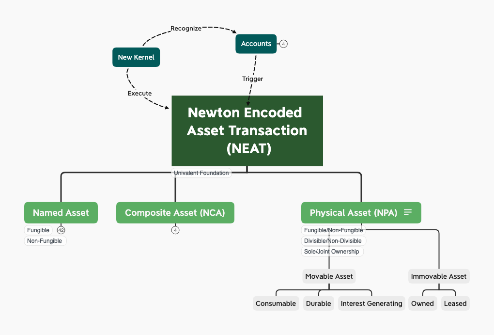

# NEP 21: Newton Physical Asset (NPA)

| Item | Description |
|:-|:-|
| NEP | 21 |
| Title | Newton Physical Asset|
| Author | [Ben Koo](mailto:koo0905@gmail.com)|
| Discussions to | https://github.com/newtonproject/NEPs/issues/21 |
| Status | Draft |
| Type | Standard |
| Category | Technical |
| Created | 2020-05-09 |
| Updated |  |

## Simple Summary

Newton Physical Asset (NPA) is the base class of physical asset classes. NPA requires certain proof mechanisms to be included as a part of guarantee to allow transaction of ownership. Two basic types of proof must be made available:

1. Proof of Existence: The asset must provide some mechanism to show the asset exists, such as some online API to show that certain goods or services physically exist, that responded with some provable existence message.
2. Proof of Ownership: This mechanism must provide certain information that shows the goods or services of interest can be traded under Newton accounts.

Besides the notion of Existence and Ownership, physical assets are further divided into two broad categories, often called: [Movable/Personal](https://en.wikipedia.org/wiki/Movable_property) and [Immovable/Real Estate](https://en.wikipedia.org/wiki/Immovable_property) Properties. These asset terms are commonly used in legal and accounting practice, and will be adopted by NPA's namespace management. However, under the accounting classification of Movable Properties, a special category called [Intangible Property](https://en.wikipedia.org/wiki/Intangible_property) such as copyrights, brand names, or patents, are not considered a subclass of NPA. Intangible Property is to be classified as subclasses of Named Asset in the inheritance hierarchy of NEAT data types.

## Abstract

Newton Physical Asset (NPA) is the base asset class that uses executable contract to guarantee the existence and ownership rights of physical assets. Knowing that the cybernetic world and the physical world could exist discrepancies, NPA attempts to approximate the existence and ownership proofs using a combination of four things: Proof of Stake, Soundness Analysis, Precision Analysis, and Time-bound Proofs. These four strategies of proving ownership and existence of physical goods provide a negotiation platform for all Newton account owners to engage with transactions. The design and evolution of NPA will follow the concepts originally developed in property law[1], where the basic rights associated with properties are broadly classified as: Rights to possession, use, manage, income generated, capital, and transmissibility. These rights applies to all assets, including non-physical assets. For NPA specific asset classes, Movable and Immovable assets are distinguished. Then, within Movable Assets, Consumable, Durable, and Interest Generating assets are classified. Within Immovable Assets, Owned and Leased Assets are the two main classes. These classifications are designed to offer time-based distinctions of relationships between assets and accounts.

## Motivation

The key idea in NPA is to establish provable relationships between accounts and the physical piece of assets. NPA's main design motivation is to leverage the cryptographically-protected account system with a trust-worthy timestamp data service and existing proof of stake insurance policies to secure NPA related transactions. In other words, the key idea of NPA is to unify the overarching framework rooted in [NEAT](nep-20.md). NPA helps to reduce costs of negotiation by introducing automated reasoning mechanisms about the claims of existence and ownership through Soundness Proofs, Precision Assessment[4], and Newton's secure timestamp system.

### Reuse Code by Sharing Expertise across the Supply Chain Management Industry

Instead of requiring all NPA issuers to learn formal methods and speak in terms of Soundness, Precision, and time security. NPA will work with the standard vocabulary established in the supply chain industry, and primarily focus on proof mechanisms that are related to existence and ownership proofs. By translating the vocabulary from technical domains to supply chain domain, we can separate the work between the two professions. NPA issuers can search for existence and ownership proof in their business specific requirement language, and relevant soundness and precision reasoning mechanisms will be categorized in business terms to help NPA issuers to customize and compose existing executable code to support their needs. Once a new set of executable "smart" contract has been tested and proven to work in the marketplace with live data, the code can be shared to similar business practices across the Newton Community. Therefore, it is crucial to keep an abstract vocabulary to describe NPA, so that code reuse can be maximized.

### User Interface for NPA

When exchanging physical goods, buyers and sellers are likely to perform both sending and receiving roles interchangeably. A reason for the bi-directional sending and receiving functions on both buyer and seller sides is because physical goods might be returned or send back for repair or replacement. Therefore a set of user interfaces that define existence and ownership with precise time bounds on both ends become a significant driver in broadening user base.

The strategy for designing user interface of NPA is to insure that roles of sending and receiving are categorized into a set of functional specifications, so that the "skin" of the user interfaces can be attached to those standardized functional specifications interchangeably. By defining a set of generally applicable functional specifications for delivery and reception verification, NPA will be relatively easy to target many application contexts without having to reinvent the wheels everytime a new, but similar business model is created. This will also help Newton Community to reach a larger community base within a shorter amount of time.

### Non-repudiation Features
Once certain physical goods are delivered or received, it is necessary to make sure that senders and receivers will not repudiate their reception or sending status. To minimize these possible information conflicts, repudiation resolution process should be designed as a measurable cost component, so that anyone who decides to go through a repudiation process, the system will automatically assign risk factors to parties who breached the repudiation contracts.

### NPA knowledge as a source of income
Any vendors or buyers submitting bug reports or prescribe solutions to any of the above mentioned problems, will be automatically given credits or be rewarded of their contribution. The more of their cases being adopted and used as a resolution for future cases, the more credit they will receive. Buying and consuming as actions, will naturally accumulate operational data, and data can provide information and potential wisdom to better refine the overall framework of physical good exchange. An explicit reward mechanism will incentivize participants to actively contribute their intellect to help build up a better NPA transaction rule base.

## Specification

NPA should use [NEAT](nep-20.md) as the basis of transaction model, which implicitly leverages secure timestamping services built-in Newton Infrastructure. Then, all physical goods must work with Newton Asset Namespace (NAM), so that a unifying namespace could be leveraged to reference known types of physical goods.

The existence and ownership status of physical items, should be bounded to existing industry standards or publicly verifiable data sources. Each of these existence and data precision qualities should be bounded to version controlled automatic analytical algorithms that defines the soundness and precision claims. Unless these self-administrating features are provided, no NPA should be issued.

### Syntax and Semantics
The data structure and the meaning of transactional physical items should also be defined using ideas derived from pi-Calculus. This section inherits all features of NEAT, with the additional records that defines existence and ownership statuses.

| Syntax | Semantics |
|:-|:-|
| Account names: (Issuing Account)+ ":" (Receiving Accounts)+ |The direction of asset right transfer: Issuing Accounts -> Receiver Accounts|
| Asset IDs : (Asset ID)*  ":" (Asset ID)* |  The first set of (Asset ID)* provides asset to be transferred to Receivers' (Asset ID)* |
| Time Slots: (Newchain timestamp)+ | A sequence of timepoints of actual transactional events marked by (Newchain timestamp)+ |
| Conditions: (Deliver Condition)+ ':' (Reception Condition)+ | (Deliver Condition)+ ':' (Reception Condition)+ are two set of rules that defines the delivery and reception conditions of asset right transfer. Maybe associated with timestamp information shown in (3).|
| Comment Field: (Natural Language content that describes the contract) | A field dedicate for human understanding, like the Ricardian Contract. The comments of NEAT can be written in a formatted template, the format could follow Logic Model.|
| Collateral Asset: (Asset ID)+ Collateral asset as a guarantee for participants of this transaction. This is usually defined by the insurance policy for the amount of resources to be issued to participants when transactions failed. | (Asset ID)+ should be a set of transferrable assets that will be distributed in case the transaction fails. Initially, this can be certain amount of Newtons made available to insure the risk coverage of possible transaction failure modes. |
| Reimbursement Rules: (Rule for Reimbursement)+  A contract explicitly defines how to reimburse the participants when the transaction failed to work. The allocation of funds should be independent of the creator of this NEAT type. | (Rule for Reimbursement)+: An automated executable contract, written in scripts that would allocate the available cryptographically ensured funds to participants according to various deliver/reception status. The creator of the executable contract should demonstrate that they are NOT in positions of conflict of interest. |
| Existence : (Rule for existence)+, (identity of physical item), (existence status)  A list of rules stating how to judge the existence of certain name-identified physical item, in a set of defined existence status. | (Assessment of Existence)+: A set of Soundness and Precision assessment algorithms defined in executable formats in Newton Infrastructure. |
| Ownership status: (Owner Account)+, (Rule for ownership status)+  A list of rules that defines the owners' identity, and a their ownership status of the above mentioned physical items in the existence field. | (Assessment of Ownership)+: A set of Soundness and Precision assessment algorithms that can automatically check ownership status of the mentioned physical items in Newton Infrastructure. |

### Interaction / Functions

| Function | Description | Behaviors/Properties |
|:-|:-|:-|
| Receivers | Add Issuing Account to the collection of accounts that can create and modify the executable contract in the form of NEAT. | permission: owner |
| Senders | transfer owner of this executable contract to other Newton Accounts | permission: owner |
| CreateNewToken | Create a new instance of NEAT token from this contract |  |
| AddMemberBySubscribe | Add participating members to the collection of Newton accounts that can transfer or receive data representable assets in the specification defined by NEAT.| permission: contract |
| RemoveMember | Remove participating members | permission: owner/admin |
| Initiate Transaction | Initiate transaction based on contractual conditions. | permission: contract |
| Exit Transaction | Terminate Transaction based on contractual conditions.| permission: contract |

## Rationale

The transactions of digitally representable assets can be best illustrated by the four fundamental rights as explained by Richard Stallman's "Free Software, Free Society"[[available here](https://www.gnu.org/philosophy/fsfs/rms-essays.pdf)].
| Free Software | pi-Calculus Concept |
|:-|:-|
| The right to use Software |The choice to engage certain interactive process (Human choose to use certain piece of software)|
|The right to understand the working mechanisms of Software | Parallel execution of the software, including mirror the understanding of the working principles|
|The right to modify the software for other Uses | Change the software in ways that covers the way it didn't work before (Prohibit or enable certain new functions)|
|The right to re-distribute the modified Software | Replicate the software/data asset in alternative distribution channels (Re-distribution for profit)|

Leveraging the fundamental rights to the four composable rules, one can define a way to cover a wide range of data asset transaction scenarios that have been investigated for decades by prior luminaries, such as Richard Stallman,  Robin Milner, and Leslie Lamport.

## Backwards Compatibility

All NEPs that introduce backwards incompatibilities must include a section describing these incompatibilities and their severity. The NEP must explain how the author proposes to deal with these incompatibilities. NEP submissions without a sufficient backwards compatibility treatise may be rejected outright.

## Test Cases

All test cases of NEAT should be classified into two kinds:
1. Safety tests: examining conditions for when the contract execution will not cause undesirable situations.
2. Liveness tests: examining conditions for when contract execution will ensure something desirable would actually happen.

The safety and liveness tests should be created based on tools such as Static Analysis and TLA+ and other similar test case generation tools.

Test cases for NEAT should first be conducted on dedicated Newton Test Chain, so that the compatibility of the system could be managed between the two systems.

## Security Considerations

Every NEAT type should be a totally isolated container of its own risks. Every subtype of NEAT will define an equivalent class of risk as measured by our Control Plane. Therefore, the assets associated with the NEAT type should be defined as a bounded liability, so that its risk factors are isolated from the other parts of Newton infrastructure.

### The Mechanisms of Proofs

With modern Internet of Things (IoT) Infrastructure, many physical goods and services can attain multi-party, or independent sources of existence proof or ownership proof. Massively manufactured online sensors and actuators usually come with a Media Access Control Address (MAC address), these kind of information can provide the unique identities and locations of information validity. Couple with a distributed timestamp, which will be provided by Newchain, a time-bound security mechanism can be established to validate the proof. In NPA, we suggest the use of static analysis techniques, such as Abstract Interpretation [[1](https://www.di.ens.fr/~cousot/AI/)] to perform Soundness and Precision Analysis. The notion of Soundness and Precision must be interpreted abstractly, meaning that the quality of NPA should be judged by how well the NPA presents "[sound](http://www.pl-enthusiast.net/2017/10/23/what-is-soundness-in-static-analysis/)" judgement and "precise" approximation [[2](https://cacm.acm.org/blogs/blog-cacm/236068-soundness-and-completeness-with-precision/fulltext)], as defined in static analysis tools, independent from the concrete execution of product transaction activities. All subclasses of NPA should follow the Soundness and Precision definition presented in this document, so that every NPA's risk profile can be assessed based on these formally defined characteristics.

Every sub class of NEAT must go through a rigorous process to demonstrate that risks are divided into explicitly defined namespaces. The technical term is called identifying "Behavioral Equivalence". Assets that can be exchanged through the same kind of transactional mechanisms, should use the same "class" of NEAT contract. The security features of each NEAT contract should be proven through the software development process. Certain anecdotal thinking can be found in Steiner's blog entry[[5](https://blog.ethcore.io/security-is-a-process-a-postmortem-on-the-parity-multi-sig-library-self-destruct/.)]. However, to reach a more rigorous level of security, NEAT should try to prove and approve every new subclass following formal methods as described in Rosu's paper: [6]. Rosu also leads the [K Framework](http://www.kframework.org/index.php/Main_Page) development, which is a rewrite-based language design model that can be used to define and verify formal properties of languages, such as security related properties. The working mechanism of proofs are managed in a namespace known as types of NEAT, so that all risk factors can be first reasoned in the categories, or types of risks, before committing to real world applications.

## References
1. Alison Clarke, Paul Kohler, Property Law: Commentary and Materials, Cambridge University Press, 2006

2. [Alex Pentland, Alexander Lipton, and Thomas Hardjono, Building the New Economy](https://wip.mitpress.mit.edu/new-economy), MIT Press

3. [Patrick Cousot, Abstract Interpretation](https://www.di.ens.fr/~cousot/AI/), Website

4. Bertrand Meyer, Soundness and Completeness: With Precision, Blog@CACM, April 20, 2019, [Web](https://cacm.acm.org/blogs/blog-cacm/236068-soundness-and-completeness-with-precision/fulltext), [Web](https://cacm.acm.org/blogs/blog-cacm/236068-soundness-and-completeness-with-precision/fulltext)

## Copyright

Copyright and related rights waived via [CC BY-SA 4.0](https://creativecommons.org/licenses/by-sa/4.0/).
