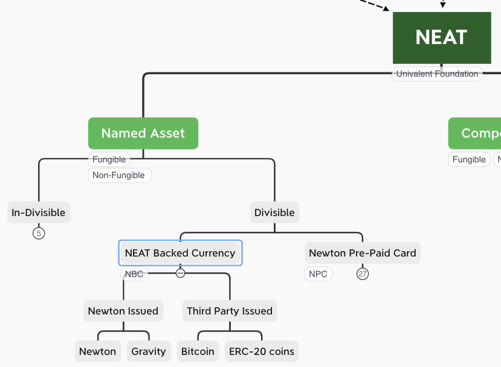

# NEP 23: NEAT Backed Currency (NBC)

| Item | Description |
|:-|:-|
| NEP | 23 |
| Title | NEAT Backed Currency|
| Author | [Ben Koo](mailto:koo0905@gmail.com) |
| Discussions to | https://github.com/newtonproject/NEPs/issues/23 |
| Status | Draft |
| Type | Standard |
| Category | Technical |
| Created | 2020-05-07 |
| Updated |  |

## Simple Summary

[NEAT](nep-20.md) Backed Currency (NBC) is a kind of cryptographically secured currency following the design protocol of NEAT. The goal of this creation is the allow anyone to create a set of exchangeable, and divisible asset that can be securely exchanged using the platform provided by Newton Community. We used the term community, because the distributed security, must be backed by a community of infrastructure providers and a rather healthy exchange community. By sharing the same set of features and capabilities developed by the entire Newton Community (NC), the quality and functionalities of the "currency" of interest could leverage the engineering and community support that has been developed over the years.

## Abstract

NEAT-based Currency (NBC), is a divisible kind of asset that can be used as a unit of exchangeable value, to be transferred between two accounts in a community of choice. This community must leverage certain set of cryptographically secure protocols, so that asset exchange can be conducted under the same level of cryptographic protection. To create a new currency for exchange in a chosen community, certain community identity management system, and its account management system must be in place. For now, we will assume that the participants will start with existing Newton ID and NewKYC account management system. So that they will enjoy the same level of security. More over, all NEAT-backed Currency should follow the requirement as mentioned below:
* A currency must be guaranteed by a collateral asset, controllable under a cryptographically protected system,
* The entire transaction history will leverage NewChain's secure timestamping services,
* The initial participating accounts will only include NewID and NewKYC,
* The exchangeable asset (currency) identities must be conserved and immutable (Quantitative Easing NOT ALLOWED),
* The participation of asset exchange can be defined by the NBC issuers and participants.
* Univalence: the security and value of cryptographically protected asset is defined by a unifying technical parameters of the security system. When there is a large number of NBCs, individual NBC's technical security risk can be isolated from the market value fluctuation of a specific currency.

## Motivation

There are many organizational or community governance tasks that requires certain scoring or asset distribution system. To construct a secure system takes both technical know how and a significant amount of financial investment. NBC provides a solution to allow a larger number of people to create a small pool of assets, and allow these assets to be exchanged between participating parties. To make this system generally useful, the goal of NBC is to isolate the value of exchangeable asset from external marketplace as much as possible. Participants should measure and assess the value of the currency, purely on the security features of the exchange system, and a common clock of all exchange activities. This isolation of value judgement will significantly broaden the use of NBC, and allows more people to adopt this infrastructure of their own use. We list a number of possible usecase scenarios to motivate the design.

### Software Implementation and Content Development Communities
A key component of value in cooperative content development or software development, is not often not the financial incentives, but the timing of content presentation. If an open source community has a high rate of bug-fixing responses, the overall user satisfaction will increase, therefore improve the ecology of the software user community as a whole. Therefore, the key incentive structure is to have a indifferent time keeper, that registers and rewards contributors of content, that most quickly resolves the issue. In other words, the currency in the community is response time. Clearly, the market value of the response time should be validated by the actual trajectory of content/software adoption curve. Therefore, the issuance of currency can be grounded on that type of data. In other words, having a system that distribute rewards based on commonly observed data, not just temporary market arbitrage activities for some external assets, such as USDT or other highly liquid asset, will protect the essential value of a localized currency.

### Community Services
To mobilize community services, it is often necessary to keep a regular tab on how many times or how often certain services is delivered. For those contributors who are most regularly, or most frequently serving the community, a system like NBC could be the ledger of the fragmented community activities. For example, garbage pick-up and food deliver could be measured based on their record of being on-time. NBC could serve this area in helping teams to manage the quality of service using a combination of secure time stamps and other verifiable data.  

### Physical Security and Social Gathering/Distancing Measures
A critical feature of Newchain is its 3 second resolution in data blocks. This highly responsive data update rates, provide a reasonable mechanism to help monitor the physical states of certain assets and define values based on the data records. For example, high density presence of mobile phones in a certain location, could indicate the physical location has high commercial/advertisement values, or large social distance risks. Therefore, issuing a currency based on this rather objective and publicly observable data set, can offer a meaningful metric to define the value of physical presence in certain time slots. This kind of applications can be better supported by NBC, when assets or score keeping systems are bound to the high-resolution Newchain timestamps.

### Other Applications in generalized digital workflow
Any social or economic applications that deal with value changing with time could use NBC to measure the value created or dissipated over time. By focusing on the causal possibilities of offering solutions across the reachable locations within Newton Community, any account could contribute to or benefit from the publication of the availability of physical services or digital content. The timing and causal relations between any events, could be written up as motivating programs that identify certain patterns of behavior and direct resources for that behavior. This general programming paradigm is often called policy design. NBC provides a general purpose platform to develop executable policies under one infrastructure.

## Specification

Initially NBC just need to define the name of the currency, the total amount of its exchangeable units, and the conditions of who and when certain participants can exchange the declared units. For the purpose of human cognitive load, NBC will not allow quantitative easing, or splitting or stock, in any NBC. To make certain asset having more divisible resolution, one can transfer all the asset into a new NBC. That means, this division will require a significant amount of participant to agree with such transfer. In any case, NBC should be simple, so that people know what they are getting into and what they will face into the future. Once certain asset transfer policy is issued for an NBC, all existing asset will follow the same policy from that point onward. So that all asset valuation will attain certain consistency in value exchange.

### Syntax and Semantics
The issuance of NBC can follow the following procedure:

|Step| Essential Term | Explanation|
|:-|:-|:-|
|1|Initial State | Identify an unused name in the NBC registry|
|2| Guaranteed Deposit | Certain initiator deposits certain valuable asset for the initial offering of NBC. |
|3| Exit Policy | A self-executing "smart contract" will be written for how to redistribute the division of deposited asset when the NBC must be dissolved.|
|4|Immutable Division | Define a total number of divisions for the newly created NBC. This cannot be changed ever|
|5|Distribution Rights|The account that deposited the initial asset will have the right to distribute the divisions as created.|
|6|Participation Rights|A "smart contract", or a list of conditions for who in the Newton Community can participate in the exchange.|
|7|Rights to Expand Properties|Any participant can increase the deposit|
|8|Backward Compatibility|Any NBC account has the right to continue cash out residual value based on current exchange rates or the Exit Policy|

### Deployment Procedures

The creation of NBC should follow a conservative stance. The goal is not to quickly create many exchangeable assets, so that many people could quickly create many gambling pools. The goal is to create a series of highly secure and useful patterns for governance. Therefore, the following policies should be obeyed to reduce, and ideally eliminate opportunistic creation of NBC.

1. All newly created NBC should have an initially high entrance barrier, such as a large deposit, and it should be locked down in months even years, so that it forces creators of new NBC would not be short term players.

2. All NBCs are some form of community or organizational governance instrument, so that its use and its performance data in real time is of great value. It should be protected and would follow the same kind of public disclosure and participants' identities would be protected using a set of security measures offered by the Newton Infrastructure.

3. Because all NBCs must be kept for as long as Newton Infrastructure exists. Therefore, a maintenance fee for its data and bandwidth consumption must be collected to support the infrastructure. This amount of fee needs to be dynamically adjusted based on the ongoing pricing of computation and communication costs at the time.

## Rationale (optional)

Allowing non-technical people to create NBC is the mission. However, there are much more governance techniques required to manage and orchestrate the communities that uses NBC. Currency issuance is clearly going to be a new dimension that organizations that adopts NBC must learn from the overall Newton Community. Therefore, a think tank organization that specializes in currency mechanism design must be initiated to develop material that shows NBC creators and participants to better practice their use of NBC. Currency is designed to be liquidable assets, so that it is a double edged swords. It must be used with tremendous care.

## Test Cases (optional)

Newton Community itself should be the first one to practice the use of NBC. The currency should be the Newton currency as it is being used on the Internet.

Before we deploy the first NBC, certain kind of social dynamics and organizational infrastructure must be prepared. For example, one should use TLA+ and NetLogo to assess the symbolic dynamics and agent-based system dynamics of a group of participating agents. Then, a procedure will be deployed and submitted to the following Safety and Liveness tests. After certain iteration, we will deploy the actual NBC to Newton Community.

1. Safety tests: After a meaningful NBC creation procedure is defined, a relatively small amount of Newton should be issued as a test case for NBC creation. Then, the community that develops NEPs and other mechanisms for Newton Community evolution should be organized through this NBC.
2. Liveness tests: The cases where the first NBC is being used and how it affects the community could be the liveness case study.

## Implementation

Ideally, all Newton Community's incentive and organizational structures should be managed through the governance procedures of NBC.

## Security Considerations

To ensure security, creation of NBC must go through certain stress test and system test phases. The proposition here is that the first three years, all NBC creation should be submitted through both technical and branding committee, so that decisions for creating currencies would not contradict, or competing with each other for obvious reasons. Overtime, the competing interests should be encoded into some kind of Byzantine Fault Tolerance Mechanism.

## References
1. Leslie Lamport, Time, Clocks, and the Ordering of Events in a Distributed System, Communications of the ACM, July, 1978.

## Copyright
Copyright and related rights waived via [CC BY-SA 4.0](https://creativecommons.org/licenses/by-sa/4.0/).
