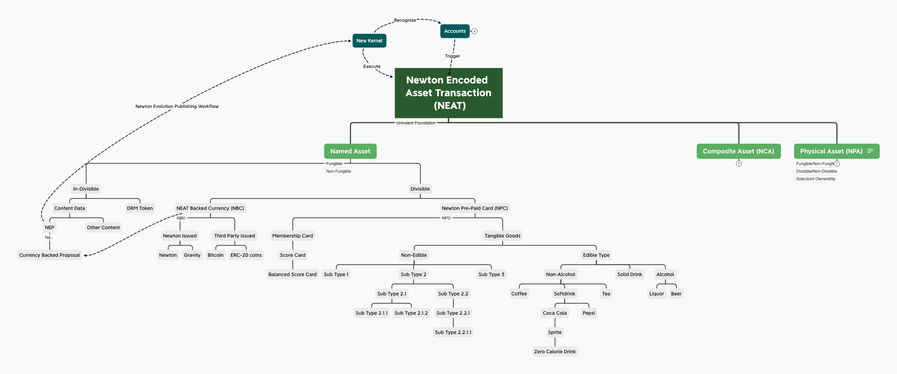

# NEP 24: Newton Pre-paid Card (NPC)

| Item | Description |
|:-|:-|
| NEP | 24 |
| Title | Newton Pre-paid Card|
| Author | [Ben Koo](mailto:koo0905@gmail.com) |
| Discussions to | https://github.com/newtonproject/NEPs/issues/24 |
| Status | Draft |
| Type | Standard |
| Category | Technical |
| Created | 2020-05-07 |
| Updated |  |

## Simple Summary

Newton Pre-paid Card (NPC) is a cryptographically insured asset that works with exchangeable assets within the Newton Community. It can be extended to issue Membership Card, Score Cards, or even Balanced Score Cards. It can also possess negotiating powers in attaining tangible goods. For example, one may pre-pay for editable goods, such as vegetable, milk, or beef, or other kinds of commercially viable goods. The basic assumptions about NPC is that it provides a classification scheme to define goods. The two immediate categories are Membership Cards and Tangible Goods. These two classes are both sub-classes of Pre-Paid Card. The remaining subdivisions can be visualized in the following Class Diagram.

## Abstract

Newtoin Pre-paid Card (NPC), is a divisible asset type that can be used to claim rights to group membership, or to claim ownership to tangible goods. The classification of rights should follow certain programmable contracts. NPC as an asset type is to serve as a template for many other classes of assets. Therefore, the development of NPC is not about operating a particular membership or selling tangible goods, it is about providing a general asset classification guideline to use a smaller common base classes to handle many cases of asset transaction for its sub-classes of goods and services. On the other hand, the purpose of NPC is to help Newton Community to best reuse data management technologies and mechanisms for asset transactions. For example, due to practical needs and regulatory concerns, there should be a certain difference in managing edible goods vs. non-edible goods. Therefore, there should be a publicized set of asset classes, encoded as two subclass branches. By explicitly managing the types of various contracts, Newton Infrastructure can better support the whole community to share knowledge in using Newton Community's trust-worthy computing infrastructure. Initially, NPC assumes a single-inherentance class structure. Common interfaces between two non-directly inheritance branches can share APIs through the "interface" mechanism.

The collateral asset to guarantee values of NPC follows the original policies of [NEAT](nep-20.md). All Pre-paid Card should not only accept payment from buyers who want to own Newton Pre-paid Card, every NPC should come with an insurance policy that have a significant amount of collateral asset locked in a re-imbursement pool in case of contract breach conditions.

## Motivation

The driving force behind NPC is to establish a standarized naming framework for managed assets. Currently, pre-paid good a services are mostly guaranteed by providers' brand recognition and customer's willingness to risk their investment in exchange for advertised discounted prices. This human-trust mechanism basically leaves consumers to bare risks without any guarantee. Through the design of NPC, risks of different types of goods and services can be classified in our naming convention. Overtime, as real operational data reveals battle-ground situations for different types of goods and services, the contracts can evolve accordingly to capture the operational experience as learned data. It is crucial to emphasize that the Newton Technical Commitee is about designing a reusable framework to best support efficient business practices, it is not about operating actual services and good delivery. This position distinguishes the system design from profit making to community supporting. NPC wants as many types of membership groups, various kinds and large amounts of tangible goods to be bought and sold on the Newton Platform, so that all technical decisions for NPC must be vendor neutral.

## Specification

NPC is a subtype of NEAT, so that it will automatically inherit all the features of NEAT. The unique feature of NPC, is in its name, the notion of customer pre-payments. In other words, a significant amount of commercial risk is being shared by customers who pay ahead of time. To become eligible as an issuer of NPC, creator of NPC must demonstrate that they have the ability to deliver the announced services and goods. This process is almost identical to the process of "crowd funding". Therefore, the qualification procedure that reveals the capabilities of potential capabilities of NPC issuer is the basis of NPC.

For service providers, such as club membership NPC issuer, history or proposed services must be articulated and presented as a part of the process to propose an NPC. Similarly, product providers should illustrate the types, qualities, and quantities of goods that certain vendor is capable of providing, so that they can offer to sell pre-paid cards. From NPC's technical viewpoint, NPC's nature is a publishing service for vendors to reveal their goods and services. The main security features of NPC is to show that all data concerning goods and services are irrefutably presented by the receiver of pre-paid assets. Establishing a content submission and account receivable channel, and make sure that both customers and vendors know that Newton only provides an irrefusable communication channel is the technical scope of NPC. In other words, NPC is not about designing a crowd funding website, NPC is about creating a irrefuable proof mechanism between vendors and potentially pre-paying customers. The focus of NPC is the security mechanism, not the product/service specific functionality.

Beside focusing on security and irrepudiability, NPC also needs to provide guidelines to explain how to classified goods and services. Membership Cards often defines a given duration to service access, while Tangible Goods often defines rights to claim ownership. The technical focus of NPC is to show that each type of services and products might need a slightly different composition of verification API. For example, Membership Cards might need a time-based API, for verifying the validity of services. Where Tangible Goods might need an inventory checking API to see if certain goods are still available or not. These kinds of differences defines the types, so that NPC can give a common classification to different composition of status verification API. By offering a meaningful classification structure, more people can use NPC.  

### Syntax and Semantics

Here, pi-Calculus will play a major role in defining these interactions. For example, Membership Card would define a set of conditions, that illustrates the four basic components of:

1. Choice of service package. Each given a name
2. Parallel composition of service tracks
3. Refusal or Prevention of certain services or event from occurence, (i.e. Non-Smoking)
4. Replication of service
5. Stopping of service.

By defininig a general set of service names, all Membership Cards can use the same vocabulary to define their service terms, so that Newton Infrastructure can be the technical provider of these service negotiation data, not the guarantor of these services.

The same syntax and semantics works for Tangible Goods. For example:

1. Choice of products and amount defined by units and names of products
2. Parallel composition of Product Delivery
3. Refusal to certain products given certain composition.
4. Replication of Products.
5. Terminating product ownership status.

A set of programming interface will be defined for each of the two main subclasses, and all other services and products will follow this template to define other contracts.

## Rationale

NPC being a financial instrument, it must have some grounding rule to be acceptable by the broadest possible audience. The key idea is the notion of equality, to be explained in the term: Univalent Principle.

### Univalent Foundation

[Univalent Foundation](https://en.wikipedia.org/wiki/Univalent_foundations) is a type-based mechanism to identify equivalence. Since data security and system integrity is achieved under a common transaction processing language [NEAT](nep-20.md), every NPC here is a type of transaction, and every instance of transaction should follow the same set of constraining rules. That gives a "equivalent" kind of fairness to all transaction. Having said that, it means all NPCs must strive to demonstrate certain objective fairness and security through its design. A starting point is to deposit certain amount of asset that reaches publicly agreements, then, all transactions can happen given that insurance asset is available to guarantee fairness. Other forms of fairness should be provided and tested prior to a release of any NPC. The reason being that any breached contract could cause significant social and economical damage to the system, therefore, a unifying safety procedure must be presented and followed for all systems.

#### NPC's unique functions

NPC differs from other transactions in a sense that services and products are not directly controllable by the Newton Infrastructure. Therefore, the risks that incurred here must be somehow contained within the boundaries of the vendor that created their brand of NPC. The total amount of assets to be offered in exchange of pre-payments must have certain Univalent Principles to be automatically checked by the system. Otherwise, it would render the system to carry the risks for the NPC offering vendors, that is clearly not feasible.

Therefore NPC must offer the following guarantee to its customers:
1. Certain amount of deposit that ensures customer satisfaction.
2. Minimal amount of deposit must fulfill conditions of Byzantine Fault Tolerance.
3. Complete certain testing cycles before releasing to the public.
4. Testing cycle will collect operational data, and this data must be revealed to its potential customers.
5. NPC should have a screening procedure for its customers. Customers who is willing to participate must demonstrate certain level of data literacy before they are allowed to issue the initial down payment.
6. Customers who enter the NPC agreements should agree to the reimbursement strategies prior to participation, so that potential conflicts can be minimized.
7. All subtypes of NPC should strictly follow this agreement, otherwise, we will not be able to achieve Univalence, therefore breaching the system correctness assumptions as shown in [NEAT](nep-20.md).

### Deployment Concerns

The proper way of seeing NPC is to think of it as a class of financial future. It provides an abstract mechanism to allow vendors to receive payment prior to delivery of services or goods. This time difference is a privilege, and therefore will induce risks on customers. Newton's technology infrastructure is to provide vendors who deserve this opportunity to issue a financial future, while offer a technological platform to inform customers of risks at the earliest possible times.

## References

1. Leslie Lamport, Time, Clocks, and the Ordering of Events in a Distributed System, Communications of the ACM, July, 1978.

2. Robin Milner, The Polyadic Pi-Calculus a Tutorial, October, 1991

## Copyright
Copyright and related rights waived via [CC BY-SA 4.0](https://creativecommons.org/licenses/by-sa/4.0/).
