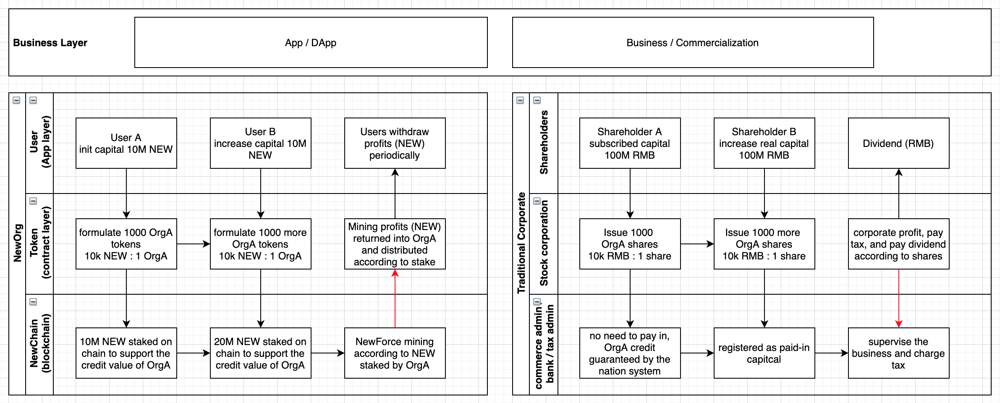
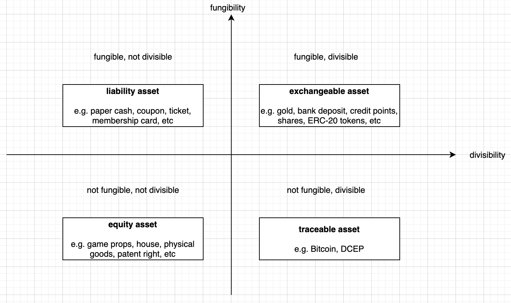

# NewORG  Standard (NRC-X)

| Item | Description |
|:-|:-|
| NEP | to be assigned |
| Title | New paradigm of organization |
| Author |  [Evan Liu](mailto:evanliuchina@gmail.com), [Xia Wu](https://github.com/xiawu), [Lee Willson](https://github.com/leewillson), [Zhou Xiqiao](https://github.com/zhouxiqiao), [Yong Liu](mailto:liuyong5653@163.com), [Qu Jianwei](https://github.com/i29) |
| Discussions to | https://github.com/NewORG-Standard-Group/NEPs/issues/1 |
| Status | Draft |
| Type | Standard Track |
| Category | technical |
| Created | 2020-04-23 |
| Updated | |

This is the suggested template for NewOrg NRC-X.

## Simple Summary

NewOrg template standard represents the living organization in newton ecosystem and a new DAO paradigm for the next generation social governance and collaboration.

## Abstract

NewOrg methods and standard based on NewChain and smart contract technologies are defined as is:
1. based on NewChain and its smart contract technologies.
2. to replace the traditional limited corporation with new governance paradigm based on blockchain technologies.
3. to define a set of meta rules for organization governance, and clarify the separation of these rules between NewChain layer and contract layer to implement: (1) business irrelative meta rules; (2) flexibility of neworg governance token; (3) anchoring all neworg to NewChain.
4. compatible with staking nodes as well as NewForce incentivization model in current NewPay for easier migration.
5. a complete open standard for any organization, institution, goverments to create NewOrg and transfer the centralized trust to the decentralized infrastructure and trust.

## Motivation

To replace the traditional limited corporation with new governance paradigm based on blockchain technologies, illustrated as below:

## Specification

### Meta Data

| Item | Description | Behaviors/Properties |
|:-|:-|:-|
|**org info:**|
| name | the org name | cannot be changed |
| type | the org type | types available: TBD |
| icon | the org icon (URL) | URL to an image |
| region | the region of the org | country/region |
| url | the link to the official website of the org | URL to org website |
| versionTag | the verison of the org | x.y.z |
| owner | the owner of the org | governance operations can be freely defined by the smart contracts |
| description | the description text of the org | limited length: TBD bytes |
| orgStatus | the org status | freeze/unfreeze |
| stakingCapital | the capital (NEW) the org staked | |
|**org token:**|
| symbol | the symbol of the org token | 3-4 uppercase letters, e.g. BTC, NMCT, etc, which cannot be changed |
| totalSupply | the total supply of the org tokens | could allow to be increased/decreased |
| decimals | the decimals of the org token | the granularity of the org tokens |
| stakeholders | the stakeholders having org token | address => # of org tokens |
| stakeholderTypes | the type of the stakeholder having org token | address => type (0 - invalid; 1 - voter; 2 - partner) |

### Interaction / Functions

| Function | Description | Behaviors/Properties |
|:-|:-|:-|
|**Owner**|
| constructor() | create org token (which represents an org) | permission: owner |
| addAdmin | add administrator | permission: owner |
| removeAdmin | remove administrator | permission: owner |
| freezeOrg | freeze org | permission: owner |
| unfreezeOrg | unfreeze org | permission: owner |
| changeOwner | change the owner of org | permission: owner |
| mint | mint new org tokens | permission: owner |
| burn | burn org tokens | permission: owner |
|**Shareholders**|
| increaseCapital() | deposit capital and mint new org tokens | permission: all |
| decreaseCapital() | withdraw capital and burn org tokens | permission: stakeholder |
| increaseVote() | increate vote and mint new org tokens | permission: all |
| decreaseVote() | decrease vote and burn org tokens | permission: stakeholder voter | 
| interestOf(address) | query the profit | |
| withdrawInterest() | withdraw the profit | permission: stakeholder |
|**Query**|
| balanceOf(address) | query the balance | having org token (stake) to be an org member |
| transfer(from, to) | transfer the ownership of org tokens | |
| approve(spender, value) | delegate others to operate my org tokens | |
| allowance(owner, spender) | check the delegation status | |
| transferFrom(from, to, value) | transfer org tokens of who delegates | |
| totalSupply | query the total stake of the org | |
| name | query the org name |  |
| symbol | query the symbol of the org token (stake) |  |
| decimals | query the decimals of the org token | granularity of the org token |
| owner | query the owner of the org |  |
| isStakeholder(address) | query if having org token | |
| stakeholderTypeOf(address) | query the type of the stakeholder | (0 - invalid; 1 - voter; 2 - partner) |
| stakingCapital | the amount of capital (NEW) the org staked | |
| orgStatus | the org status | freeze/unfreeze |

## Issues

- Q: Should it be allowed to create org without defining org token?
	* A: It depends on the concreate product implementation.

- Q: Should it be allowed to create asset tokens without linking with an org token?
	* A: It depends on the concreate product implementation.

## Rationale

## Asset Token Matrix

Possible asset tokens could be formulated with the following Boston matrix:

## Test Cases
TBD

## Implementation
TBD

## References

* ERC-20 https://eips.ethereum.org/EIPS/eip-20 

## Copyright
Copyright and related rights waived via [CC0](https://creativecommons.org/publicdomain/zero/1.0/).
