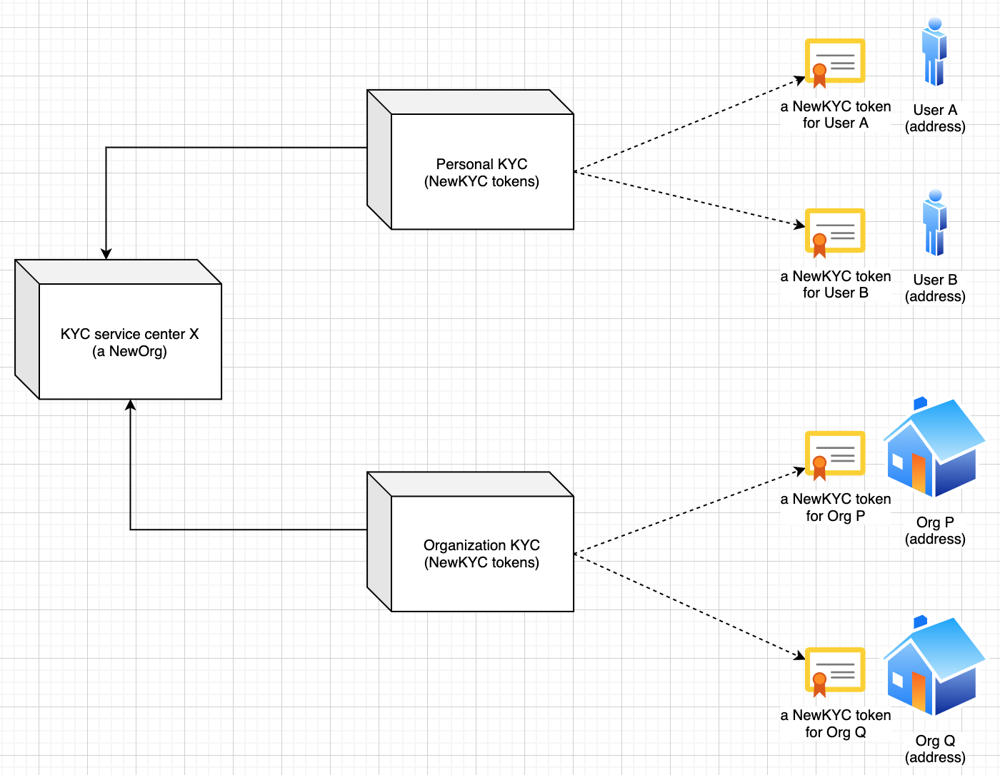

# NEP-N: NewKYC Token Standard (NRC-N)

| Item | Description |
|:-|:-|
| NEP | to be assigned |
| Title | NewKYC Token Standard (NRC-N) |
| Author | [Evan Liu](mailto:evanliuchina@gmail.com), [Xia Wu](https://github.com/xiawu), [Ben Koo](koo0905@gmail.com), [Zhou Xiqiao](https://github.com/zhouxiqiao), [Yong Liu](mailto:liuyong5653@163.com), [Wei Xuefeng](https://github.com/weixuefeng) |
| Discussions to | URL |
| Status | Draft |
| Type | NRC |
| Category | Technical |
| Created | 2020-05-11 |
| Updated | 2020-05-11 |

## Simple Summary

NewKYC token standard (template) is designed for the decentralized on-chain proof of KYC (Know-Your-Customer), which can be held by user address, NewOrg, etc that would have KYC requirements.

## Abstract

On-chain KYC token that can be issued by communities in a decentralized way.

## Motivation

We can have either an individual or an organization on chain, however, especially for an organization, in many scenarios, it is good to have an 3rd party trusted verification service for users to easily identify it. The way to do it is left to be a difficult question. This standard is a try.

## Specification

Here is a possible solution:

1. Anyone can create an NewOrg "KYC service center X" with a certain amount of deposit for providing the NewKYC service.
2. When requested, the NewOrg "KYC service center X" can respond, verify, and certificate by issuing a NewKYC token specifically for the requester.
3. The requester can hold the NewKYC token under his/her/its on-chain address for the proof of KYC. He/she/it can hold only one NewKYC token issued by a KYC service center.

### Meta Data

| Item | Description | Behaviors/Properties |
|:-|:-|:-|
| org | The NewOrg that issued the NewKYC certification token | cannot be changed |
| holderTokens | mapping(address => struct Token) | cannot be transferred |
| name | A descriptive name for a collection of tokens in this contract | can not be changed |
| symbol | An abbreviated name for tokens in this contract | can not be changed |

struct Token:
| Item | Description | Behaviors/Properties |
|:-|:-|:-|
| verifiedName | The name verified by the KYC process | cannot be changed |
| website | The verified link to its official website | cannot be changed |
| email | The verified email address | cannot be changed |
| contact | The verified contact info (e.g. mobile phone) | cannot be changed |

### Interaction / Functions

| Function | Description | Behaviors/Properties |
|:-|:-|:-|
| issue(address) | issue a new NewKYC token to the address | should be approved by org |
| invalidate(address) | invalidate the NewKYC token held by the address | should be approved by org |
| **KYC info queries** |||
| isVerified(address) | if it owns a NewKYC token | |
| verifiedNameOf(address) | gets its verified name |  |
| websiteOf(address) | gets its verified website |  |
| emailOf(address) | gets its verified email address |  |
| contactOf(address) | gets its verified contact info (e.g. mobile phone) |   |

## Rationale (optional)

TBD

## Backwards Compatibility (optional)

TBD

## Test Cases (optional)

TBD

## Implementation (optional)

TBD

## Security Considerations (optional)

TBD

## References (optional)

* NRC-12: NewOrg Standard https://github.com/newtonproject/NEPs/blob/master/NEPS/nep-12.md

## Copyright
Copyright and related rights waived via [CC0](https://creativecommons.org/publicdomain/zero/1.0/).
