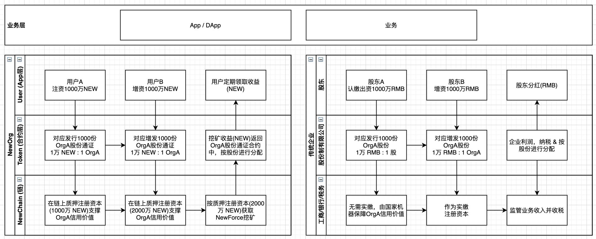
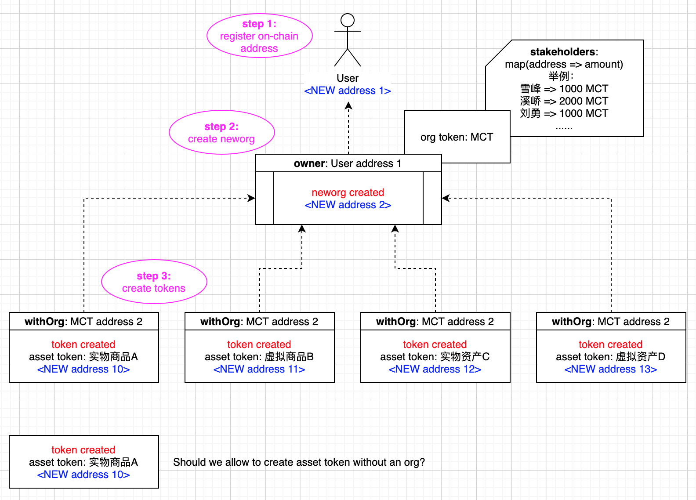

# NewORG  Standard (NRC-X)

| Item | Description |
|:-|:-|
| NEP | to be assigned |
| Title | New paradigm of organization |
| Author |  [Evan Liu](mailto:evanliuchina@gmail.com), [Xia Wu](https://github.com/xiawu), [Lee Willson](https://github.com/leewillson), [Zhou Xiqiao](https://github.com/zhouxiqiao), [Yong Liu](mailto:liuyong5653@163.com), [Qu Jianwei](https://github.com/i29) |
| Discussions to | https://github.com/NewORG-Standard-Group/NEPs/issues/1 |
| Status | WIP |
| Type | NewOrg Template |
| Category | technical |
| Created | 2020-04-23 |
| Updated | |

This is the suggested template for NewOrg NRC-X.

## Simple Summary

牛顿生态体系中的生命力组织NewOrg模板是下一代社会治理和协作的NewDAO新范式。

## Abstract

本标准定义了基于NewChain及其智能合约技术实现NewOrg的方法和标准：
1. 基于NewChain及其智能合约技术
2. 用基于区块链技术的治理新范式取代传统股份有限公司治理范式
3. 定义一套组织治理的元规则，并将该套元规则在NewChain链层和合约层进行划分，实现了(1)元规则的业务无关性，(2)组织股份通证治理的灵活性，(3)NewChain对所有组织的抓手
4. 该模型可兼容目前NewPay中既有的锁仓节点和NewForce挖矿模型，可以比较容易迁移过来
5. 完全开放的标准，任何组织、机构、政府部门等都可以创建NewOrg，将中心化信用直接平移到去中心化基础设施上，成为去中心化信用

## Motivation

用基于NewChain区块链及其智能合约技术的治理新范式取代传统股份有限公司治理范式。见下图：

## Specification

### Meta Data

| Item | Description | Behaviors/Properties |
|:-|:-|:-|
|**org info:**|
| name | 组织名称 | can not be changed |
| type | 组织类型 | 定义：... |
| icon | 组织头像(URL) | URL to an image |
| region | 组织所在区域 | 国家/地区 |
| url | 组织官网链接 | URL to org website |
| versionTag | 组织版本 | x.y.z |
| owner | 组织创始人 | 各种治理操作(比如扩股缩股等),规则可由合约自定义实现 |
| description | 组织介绍 | 限定长度 XX 字节 |
| orgStatus | 组织状态 | 允许冻结(freeze/unfreeze) |
| stakingCapital | 组织实缴质押资本(NEW) | |
|**org token:**|
| symbol | 组织通证(股份)代号 | 3-4个大写字母，如BTC、NMCT等, can not be changed |
| totalSupply | 组织通证(股份)总量 | 允许增资扩股 |
| decimals | 小数位数 | 组织通证(股份)可分粒度 |
| stakeholders | 组织通证持有者(股东) | address => # of org tokens |
| stakeholderTypes | 组织通证持有者(股东)类型 | address => type (0 - 失效/移除; 1 - 投票人; 2 - 合伙人) |

### Interaction / Functions

| Function | Description | Behaviors/Properties |
|:-|:-|:-|
|**Owner**|
| constructor() | 创建组织通证 | permission: owner |
| addAdmin | 添加管理员 | permission: owner |
| removeAdmin | 移除管理员 | permission: owner |
| freezeOrg | 冻结组织 | permission: owner |
| unfreezeOrg | 解冻组织 | permission: owner |
| changeOwner | 更改创始人 | permission: owner |
| mint | 增发组织通证 | permission: owner |
| burn | 销毁组织通证 | permission: owner |
|**Shareholders**|
| increaseCapital() | 增资/相应增发组织通证(规则和算法由合约定义) | permission: all |
| decreaseCapital() | 撤资/相应销毁组织通证(规则和算法由合约定义) | permission: shareholder |
| increaseVote() | 增加投票/相应增发组织通证(规则和算法由合约定义) | permission: all |
| decreaseVote() | 撤销投票/相应销毁组织通证(规则和算法由合约定义) | permission: shareholder voter | 
| interestOf(address) | 查询收益数量 | |
| withdrawInterest() | 提取收益 | permission: shareholder |
|**Query**|
| balanceOf(address) | 查询持有量 | 持有组织通证(股份)即为组织一员 |
| transfer(from, to) | 转移组织通证所有权 | |
| approve(spender, value) | 授权他人操作我持有的组织通证 | |
| allowance(owner, spender) | 查看授权情况 | |
| transferFrom(from, to, value) | 转移授权人持有的组织通证 | |
| totalSupply | 查询组织通证总量(总股数) | |
| name | 查询组织名称 |  |
| symbol | 查询组织通证(股份)代号 |  |
| totalSupply | 查询组织通证(股份)总量 |  |
| decimals | 查询小数位数 | 组织通证(股份)可分粒度 |
| owner | 查询组织创始人 |  |
| isShareholder(address) | 查询是否组织通证持有者(组织成员/股东) | |
| shareholderTypeOf(address) | 查询组织成员/股东类型 | (0 - 失效/移除; 1 - 投票人; 2 - 合伙人) |
| stakingCapital | 组织实缴质押资本(NEW) | |
| orgStatus | 组织状态 | 允许冻结(freeze/unfreeze) |

## Issues

- Q: 是否允许只创建org而不定义org token？
- A: 由产品具体实现确定。对于Newton App的实现而言是允许的。

- Q: 是否允许不创建org而创建其他种类的token？
- A: 由产品具体实现确定。对于Newton App的实现而言，token必须关联/隶属于某一个org。

## Rationale

## Test Cases
TBD

## Implementation
TBD

## References

* ERC-20 https://eips.ethereum.org/EIPS/eip-20 

## Copyright
Copyright and related rights waived via [CC0](https://creativecommons.org/publicdomain/zero/1.0/).
